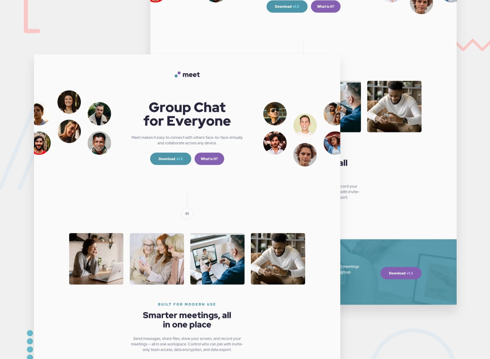

# Frontend Mentor - Meet landing page solution

This is a solution to the [Meet landing page challenge on Frontend Mentor](https://www.frontendmentor.io/challenges/meet-landing-page-rbTDS6OUR). Frontend Mentor challenges help you improve your coding skills by building realistic projects. 

## Table of contents

- [Overview](#overview)
  - [The challenge](#the-challenge)
  - [Screenshot](#screenshot)
  - [Links](#links)
- [My process](#my-process)
  - [Built with](#built-with)
  - [Useful resources](#useful-resources)
- [Author](#author)

## Overview

### The challenge

The challenge is to build out this landing page and get it looking as close to the design as possible.

Users should be able to:

- View the optimal layout depending on their device's screen size
- See hover states for interactive elements

### Screenshot

### Links

- Solution URL: [https://github.com/antoru/meet-landing-page](https://github.com/antoru/meet-landing-page)
- Live Site URL: [https://antoru.github.io/meet-landing-page/](https://antoru.github.io/meet-landing-page/)

## My process

### Built with

- Semantic HTML5 markup
- CSS custom properties
- CSS Grid
- Mobile-first workflow
- [Sass](https://sass-lang.com/) - For styles

### Useful resources

- In this is project I used a custom version of the [7-1 architecture pattern](https://sass-guidelin.es/#architecture) and sticking to [Sass Guidelines](https://sass-guidelin.es) writing conventions.

### Deploying the project

Project hosted for free, thanks to:

- [Github pages](https://pages.github.com/)

## Author

- Linkedin - [https://www.linkedin.com/in/antoru/](https://www.linkedin.com/in/antoru/)
- Frontend Mentor - [https://www.frontendmentor.io/profile/antoru](https://www.frontendmentor.io/profile/antoru)